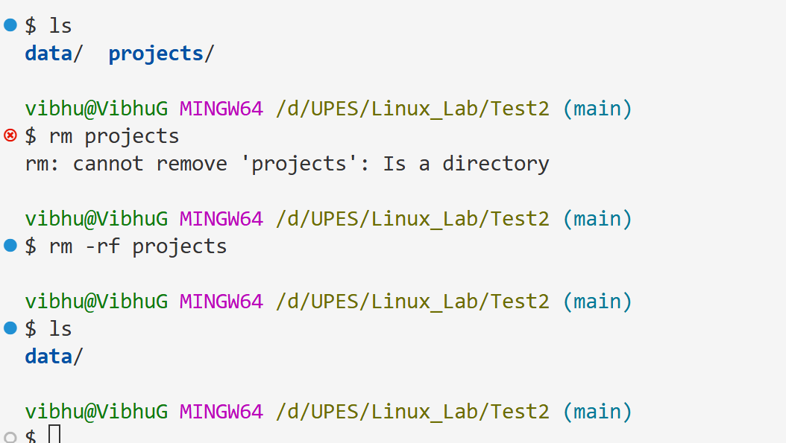

# Experiment 2

We will be walking thourgh basic linux terminal commands

---

## Command "mkdir

List any prerequisites or dependencies needed to run the scripts.

---

## Usage

Explain how to use the scripts, with examples.

---

## Bash Script Snippets

### Script 1: Description of script 1

```bash
#!/bin/bash
mkdir data

echo "Hello, World!"
