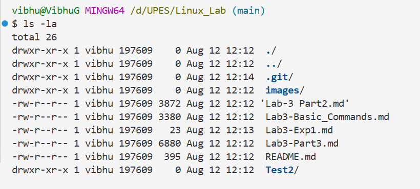

# Basic Linux Commands 

```bash
>> pwd 

```

📌 Output example:

```
/d/UPES/Linux_Lab
```
## ls command

```bash
>> ls
```

📌 Output of ls:

```
 images/  'Lab-3 Part2.md'   Lab3-Basic_Commands.md   Lab3-Exp1.md   Lab3-Part3.md   README.md   Test2/
```

### ls flags

## ls command
The ls command is linux allows to to view all the files and folder in current working directory. Flag -a list down all file and folder including the one which are hidden

```bash
>> ls -la
```
📌 Output of ls - la:

```
vibhu@VibhuG MINGW64 /d/UPES/Linux_Lab (main)
$ ls -la
total 26
drwxr-xr-x 1 vibhu 197609    0 Aug 12 12:12  ./
drwxr-xr-x 1 vibhu 197609    0 Aug 12 12:12  ../
drwxr-xr-x 1 vibhu 197609    0 Aug 12 12:14  .git/
drwxr-xr-x 1 vibhu 197609    0 Aug 12 12:12  images/
-rw-r--r-- 1 vibhu 197609 3872 Aug 12 12:12 'Lab-3 Part2.md'
-rw-r--r-- 1 vibhu 197609 3380 Aug 12 12:12  Lab3-Basic_Commands.md
-rw-r--r-- 1 vibhu 197609   23 Aug 12 12:13  Lab3-Exp1.md
-rw-r--r-- 1 vibhu 197609 6880 Aug 12 12:12  Lab3-Part3.md
-rw-r--r-- 1 vibhu 197609  395 Aug 12 12:12  README.md
drwxr-xr-x 1 vibhu 197609    0 Aug 12 12:12  Test2/
```

## Image Screen Shot

